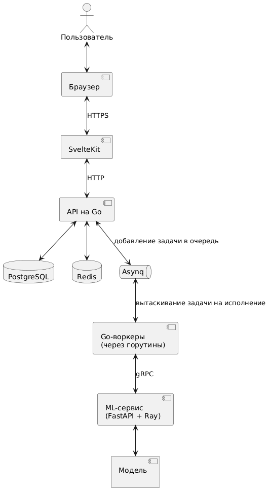

## Extrachords - веб-платформа для хранения и распознавания аккордов

**Версия:** 1.0  
**Дата:** 25.12.2025

## 1. Введение

### 1.1. Область действия

Extrachords представляет собой веб-приложение для музыкантов, позволяющее автоматически распознавать аккорды из аудиофайлов, хранить пользовательские подборы аккордов к песням и давать доступ к обучающим материалам. Система состоит из: модуля машинного обучения для анализа аудио, каталога с поиском и фильтрацией аккордов, профилей пользователей, системы модерации контента и административной панели.

**Что система НЕ делает:**

- не распознаёт ноты / табы (только аккорды);
- не выполняет синхронизацию с внешними музыкальными платформами или стриминговыми сервисами;
- не поддерживает видеоконтент.

**Выгоды и цели:**

- автоматизация процесса подбора аккордов с точностью 78-85%;
- централизованное хранилище пользовательских подборов с возможностью редактирования и модерации;
- обучающая платформа для начинающих гитаристов;
- формирование сообщества музыкантов.

### 1.2. Определения

| Термин      | Определение                                                                                       |
| ----------- | ------------------------------------------------------------------------------------------------- |
| Подбор      | Текст песни с размеченными аккордами над соответствующими словами                                 |
| Аппликатура | Схематичное изображение позиции пальцев на грифе гитары для конкретного аккорда                   |
| CQT         | Constant-Q Transform - алгоритм частотно-временного преобразования для анализа музыкального аудио |
| Ray         | Фреймворк для распределённых вычислений в Python                                                  |
| Asynq       | Библиотека для управления очередями задач в Go на базе Redis                                      |
| SSE         | Server-Sent Events - технология однонаправленной передачи событий от сервера к клиенту            |
| WYSIWYG     | What You See Is What You Get - принцип редактирования, при котором результат виден сразу          |
| gRPC        | Протокол удалённого вызова процедур на базе HTTP/2 для эффективного межсервисного взаимодействия  |

### 1.3. Ссылки

1. BTC CNN (первая модель для обучения): https://github.com/jayg996/BTC-ISMIR19
2. Harmony Transformer v2: [https://github.com/lucasnfe/adl4mir ](https://github.com/Tsung-Ping/Harmony-Transformer-v2)
3. Ray документация: https://docs.ray.io/
4. Asynq GitHub: https://github.com/hibiken/asynq
5. Melt UI (Svelte): https://melt-ui.com/
6. gRPC документация: https://grpc.io/docs/what-is-grpc/introduction/

### 1.4. Обзор документа

Документ структурирован следующим образом: раздел 2 описывает общую архитектуру системы, взаимодействие компонентов и категории пользователей; раздел 3 содержит детальные функциональные и нефункциональные требования с идентификаторами, а также интерфейсы системы (UI, API), модель данных и требования к хранению.

## 2. Общее описание

### 2.1. Взаимодействие с продуктом

Extrachords является самостоятельной системой, не интегрированной с внешними платформами на текущем этапе. Архитектура состоит из трёх основных компонентов:

- **Frontend (SvelteKit)** - клиентское веб-приложение с серверным рендерингом для SEO-оптимизации. Обеспечивает адаптивный интерфейс для всех типов устройств.
- **Backend (Fiber + Asynq)** - API для обработки бизнес-логики, управления пользователями, CRUD-операциями над подборами аккордов, статьями и уведомлениями.
- **ML-модуль (FastAPI + Ray)** - отдельный сервис для распознавания аккордов, запущенный как независимая программа. Ray обеспечивает параллельную обработку запросов, при этом бэкенд взаимодействует с ML-модулем через gRPC, что даёт высокую скорость передачи данных без лишних накладных расходов HTTP.

**БД**

- PostgreSQL - хранение структурированных данных (пользователи, подборы, статьи, аппликатуры).
- Redis - кэширование популярных данных, очередь задач Asynq, хранение сессий.

**Схема взаимодействия:**

### 2.2. Функции продукта

#### Система предоставляет следующие высокоуровневые функции:

- **F1. Управление пользователями** - регистрация, аутентификация через e-mail с подтверждением, управление профилем, система ролей (гость, пользователь, модератор, администратор).
- **F2. Распознавание аккордов** - загрузка аудиозаписей до 30 МБ, автоматическое определение аккордов с временными метками, интерактивный плеер с визуализацией звуковых волн и метками аккордов.
- **F3. Каталог подборов** - поиск по исполнителю, названию песни, тональности, сложности; фильтрация и сортировка результатов; добавление подборов в избранное (для зарегистрированных пользователей).
- **F4. Управление подборами** - создание, редактирование, удаление собственных подборов; система модерации; отображение статуса подборов в профиле; валидация структуры разметки (блоки [Verse], [Chorus], отступы).
- **F5. Обучающие материалы** - создание и публикация статей через WYSIWYG-редактор (доступно всем зарегистрированным пользователям), просмотр каталога статей.
- **F6. Административная панель** - управление пользователями (блокировка, бан), модерация подборов (одобрение, отклонение, удаление), управление ролями модераторов.
- **F7. Уведомления** - отправка уведомлений по e-mail (статус модерации подборов, новости платформы) и через SSE в браузере в реальном времени.

### 2.3. Пользователи и характеристики

- **Гость:**
  - просмотр главной страницы;
  - просмотр каталога подборов;
  - просмотр статей;
  - регистрация;
  - поиск и фильтрация подборов и статей;
    (техническая подготовка базовая)
- **Пользователь:**
  - аутентификация;
  - добавление/редактирование/удаление подборов;
  - создание статей, добавление в избранное;
    (предполагается средний уровень технической подготовки)
- **Модератор:**
  - доступ к модерации подборов;
  - работа с пользователями (кроме администратора);
    (техническая подготовка выше среднего)
- **Администратор:**
  - полный доступ с управлением ролями и сущностями
    (техническая подготовка продвинутая)

### 2.4. Окружение и ограничения

Система работает на современных браузерах (Yandex Browser, Google Chrome, Mozilla Firefox, Safari, Opera...). Серверное оборудование: стандартные VPS с Linux (Ubuntu Server 25.10), минимум 4 CPU, 8 GB RAM. Адаптивная вёрстка для ПК и мобильных устройств.

### 2.5. Предположения и зависимости

Предполагается стабильное интернет-соединение у пользователей.
Зависимости:

- доступ к SMTP-серверу для почтовых уведомлений;
- предобученные ML-модели (BTC CNN для старта, Harmony Transformer v2 для дообучения)
  Внешние факторы: изменения в библиотеках (PyTorch, Ray)

## 3. Детальные требования

### 3.1. Функциональные требования

- **FR-1** - система обеспечивает регистрацию пользователей с вводом username, e-mail и пароля; отправляет подтверждение на e-mail.
- **FR-2** - аутентификация происходит через e-mail и пароль; поддерживает роли с разграничением доступа.
- **FR-3** - профиль пользователя отображает личные данные, статус подборов (черновик/на модерации/опубликован/отклонён) и избранное.
- **FR-4** - пользователь на странице с подбором аккордов может видеть: название песни, исполнителя, тональность, сложность, текст с размеченными аккордами и аппликатуры над текстом;
- **FR-5** - модуль распознавания принимает аудиофайлы (mp3, flac, wav до 30 МБ), обрабатывает их на сервере, возвращает интерактивный плеер с волновой формой, временными метками и аккордами; файлы удаляются после обработки.
- **FR-6** - поиск подборов поддерживает параметры (исполнитель, название, тональность, сложность), фильтры и сортировку (по популярности, дате).
- **FR-7** - добавление подбора требует обязательных полей (исполнитель, название, текст с аккордами); дополнительных (тональность, сложность); валидацию структуры; доступно только зарегистрированным.
- **FR-8** - редактирование/удаление подборов запускает повторную модерацию; доступно владельцам.
- **FR-9** - создание статей через WYSIWYG-редактор доступно зарегистрированным; формат - текст с медиа.
- **FR-10** - административная панель позволяет осуществлять CRUD-операции над пользователями, подборами, ролями; модерация ручная.
- **FR-11** - уведомления отправляются по e-mail и SSE (статус модерации, новости).
- **FR-12** - главная страница отображает блоки "Популярные подборы", "Последние новости", "О нас".
- **FR-13** - генерация аппликатур происходит на основе предопределённого списка; отображается в подборе.

### 3.2. Нефункциональные требования

- **Требования к производительности:**
  - время отклика на распознавание до 60 секунд;
  - система выдерживает 30 одновременных пользователей;
  - загрузка главной страницы происходит в пределах 2 секунд.
- **Требования к надежности:**
  - uptime 99%;
  - автоматическое восстановление после сбоев через Asynq и Ray.
- **Требования к безопасности:**
  - хранение паролей в хешированном виде;
  - HTTPS для всех соединений между браузером и фронтендом;
  - защита от SQL-инъекций и XSS-атак.
- **Требования к удобству использования:**
  - интуитивный UI;
  - адаптивность для мобильных устройств.
- **Требования к сопровождаемости:**
  - модульный код;
  - тесты покрывают 80% бизнес-логики согласно отчёту о покрытии.
- **Требования к портируемости:**
  - запуск сервисов в Docker;
  - кросс-браузерная совместимость.

### 3.3. Требования к интерфейсам

- **Пользовательские интерфейсы:**
  - адаптивный дизайн;
  - соответствие стандартам WCAG 2.1 для доступности;
  - наличие модулей (страниц): "Главная" (популярные подборы / новости / о нас), "Статьи", "Каталог подборов" (поиск / добавление подбора), "Профиль" (данные / статус модерации подборов / добавление подбора), "Распознавание" (загрузка аккордов / плеер).
- **Программные интерфейсы:** маршруты для аутентификации (/auth), подборов (/chords), статей (/articles), уведомлений (/notifications); интеграция с ML-модулем через gRPC.
- **Аппаратные интерфейсы:** отсутствуют.
- **Интерфейсы связи:** HTTP(s), SSE, gRPC;

## 3.4. Требования к данным

### 3.4.1. Логическая модель данных

База **extrachords** использует следующую логическую модель данных:

#### `users` - пользователи системы

- **Назначение:** хранение информации о зарегистрированных пользователях.
- **Атрибуты:**
  - `id` - PK, уникальный идентификатор пользователя
  - `username` - имя пользователя
  - `email` - адрес электронной почты
  - `password` - хэш пароля
  - `role` - роль пользователя (guest, user, moderator, admin)
  - `status` - статус учётной записи (активен, заблокирован)
  - `registration_date` - дата регистрации

- **Связи:**
  - Один-ко-многим с `chords` (созданные аккорды)
  - Один-ко-многим с `articles` (написанные статьи)
  - Один-ко-многим с `notifications` (полученные уведомления)
  - Многие-ко-многим с `chords` через `favorites` (избранные аккорды)

#### `chords` - аккорды

- **Назначение:** хранение информации о музыкальных аккордах и текстах песен.
- **Атрибуты:**
  - `id` - PK
  - `artist` - исполнитель
  - `title` - название песни
  - `lyrics` - текст песни
  - `key` - тональность
  - `rhythm` - ритм
  - `difficulty` - уровень сложности
  - `status` - статус аккорда (черновик, опубликован)
  - `created_at` - дата создания
  - `updated_at` - дата обновления
  - `owner_id` - FK → `users.id`

- **Связи:**
  - Многие-к-одному с `users`
  - Многие-ко-многим с `users` через `favorites` (избранные)

#### `articles` - статьи

- **Назначение:** хранение обучающих и информационных статей.
- **Атрибуты:**
  - `id` - PK
  - `title` - заголовок статьи
  - `content` - текст статьи
  - `publication_date` - дата публикации
  - `author_id` - FK → `users.id`

- **Связи:**
  - Многие-к-одному с `users`

#### `notifications` - уведомления

- **Назначение:** хранение системных сообщений для пользователей.
- **Атрибуты:**
  - `id` - PK
  - `type` - тип уведомления
  - `message` - текст сообщения
  - `has_read` - признак прочтения
  - `created_at` - дата создания
  - `user_id` - FK → `users.id`

- **Связи:**
  - Многие-к-одному с `users`

#### `applicatures` - аппликатуры аккордов

- **Назначение:** схемы постановки пальцев для аккордов.
- **Атрибуты:**
  - `chord_name` - PK, название аккорда
  - `diagram_link` - ссылка на изображение

#### `favorites` - избранные аккорды

- **Назначение:** связь «многие ко многим» между пользователями и аккордами.
- **Атрибуты:**
  - `user_id` - PK, FK → `users.id`
  - `chord_id` - PK, FK → `chords.id`

- **Связи:**
  - Многие-к-одному с `users`
  - Многие-к-одному с `chords`

### 3.4.2. Требования к целостности данных

- Ссылочная целостность через PK и FK
- Уникальные ограничения для избранных аккордов (`user_id`, `chord_id`)
- Резервное копирование данных PostgreSQL ежедневно
- Кэширование и временное хранение данных в Redis без нарушения основной целостности
